# TaskManagementSystem

**Author**: Samar Ali Elsayed

## Project Breakdown

- **Backend**
- **Frontend**
- **Database (SQL Server)**

## Backend Setup

### 1. Set Up Project

1. **Install Dependencies**:
   ```sh
   npm install
   ```
2. **Start the Server**:

   ```sh
   npm start
   ```

   Server will be running at: `http://localhost:8000`

3. **.env File**:
   Create a `.env` file in the root directory of your project and add the following environment variables with your SQL database credentials:

   ```
   PORT=8000
   SQL_USER=<your_sql_user>
   SQL_PASSWORD=<your_sql_password>
   SQL_SERVER=<your_sql_server>
   SQL_DATABASE=<your_sql_database>
   JWT_SECRET_KEY=<your_jwt_secret_key>

   apiKey=<your_firebase_apiKey>
   authDomain=<your_firebase_authDomain>
   projectId=<your_firebase_projectId>
   storageBucket=<your_firebase_storageBucket>
   messagingSenderId=<your_firebase_messagingSenderId>
   appId=<your_firebase_appId>
   FIREBASE_USER=<your_firebase_user>
   FIREBASE_AUTH=<your_firebase_auth>
   STRIPE_SECRET_KEY=<your_stripe_secret_key>
   ```

   **Note**: Replace `your_sql_user`, `your_sql_password`, `your_sql_server`, and `your_sql_database` with your actual SQL server configuration details.

### 2. Set Up SQL Server

Open SQL Server and run the following queries:

#### 2.1 Create the Database

```sql
CREATE DATABASE Task;
GO
```

#### 2.2 Use the Database

```sql
USE Task;
GO
```

#### 2.3 Create the Users Table

```sql
CREATE TABLE Users (
    id INT PRIMARY KEY IDENTITY(1,1),
    password VARCHAR(255) NOT NULL,
    image VARCHAR(255) DEFAULT '1.jpg',
    firstname VARCHAR(50) NOT NULL,
    lastname VARCHAR(50) NOT NULL,
    email VARCHAR(100) UNIQUE NOT NULL,
    phone VARCHAR(20)
);
```

#### 2.4 Create the Tasks Table

```sql
CREATE TABLE Tasks (
    id INT PRIMARY KEY IDENTITY(1,1),
    title VARCHAR(255) NOT NULL,
    description VARCHAR(255),
    status VARCHAR(50) NOT NULL CHECK (status IN ('Pending', 'In Progress', 'Completed')),
    userId INT,
    FOREIGN KEY (userId) REFERENCES Users(id),
    created_at DATETIME DEFAULT GETDATE(),
    updated_at DATETIME DEFAULT GETDATE()
);
```

### 3. User Endpoints

#### 3.1 Postman Collection

- **Collection**: [Task Management API](https://documenter.getpostman.com/view/22502337/2sA3e49TzM)

#### 3.2 Register User

- **Endpoint**: `http://localhost:8000/api/v1/users/register` (POST)
- **Request Body**:
  ```json
  {
    "password": "varchar",
    "firstname": "varchar",
    "lastname": "string",
    "email": "varchar"
  }
  ```
- **Responses**:
  - **Success (201)**:
    ```json
    {
      "status": "success",
      "message": "User registered successfully"
    }
    ```
  - **Duplicate Email (400)**:
    ```json
    {
      "message": "Email already exists"
    }
    ```
  - **Validation Errors (400)**:
    ```json
    {
      "message": "Validation error message"
    }
    ```
  - **Server Error (500)**:
    ```json
    {
      "message": "Internal server error message"
    }
    ```

#### 3.3 Login User

- **Endpoint**: `http://localhost:8000/api/v1/users/login` (POST)
- **Request Body**:
  ```json
  {
    "email": "varchar",
    "password": "varchar"
  }
  ```
- **Responses**:
  - **Success (200)**:
    ```json
    {
      "status": "success",
      "token": "token"
    }
    ```
  - **Missing Email or Password (400)**:
    ```json
    {
      "message": "Required email and password"
    }
    ```
  - **User Email Not Found (404)**:
    ```json
    {
      "message": "This email is not registered. Please sign up"
    }
    ```
  - **Validation Errors (400)**:
    ```json
    {
      "message": "Validation error message"
    }
    ```
  - **Server Error (500)**:
    ```json
    {
      "message": "Internal server error message"
    }
    ```

**Note**: Token should be included in the header with key: `authorization` and value: `Bearer {token}`

#### 3.4 Get User Profile

- **Endpoint**: `http://localhost:8000/api/v1/users/userProfile` (GET)
- **Middleware**: Authentication required (Token in header)
- **Responses**:
  - **Success (200)**:
    ```json
    {
      "status": "success",
      "data": {userData}
    }
    ```
  - **Authentication Error**:
    ```json
    {
      "message": "Unauthorized. Authentication token is missing or invalid"
    }
    ```
  - **Server Error (500)**:
    ```json
    {
      "message": "Internal server error message"
    }
    ```

#### 3.5 Edit User Profile

- **Endpoint**: `http://localhost:8000/api/v1/users/userProfile` (PUT)
- **Middleware**: Authentication required (Token in header)
- **Request Body** (Optional Fields):
  ```json
  {
    "password": "varchar",
    "firstname": "varchar",
    "lastname": "varchar",
    "email": "varchar",
    "image": "varchar",
    "phone": "varchar"
  }
  ```
  **Note**: Use Multer for file upload and Firebase Storage to store the image. Save the image link in the database.
- **Responses**:
  - **Success (200)**:
    ```json
    {
      "status": "success",
      "message": "User updated successfully"
    }
    ```
  - **Authentication Error**:
    ```json
    {
      "message": "Unauthorized. Authentication token is missing or invalid"
    }
    ```
  - **Validation Errors**:
    ```json
    {
      "message": "Validation error message"
    }
    ```
  - **Server Error (500)**:
    ```json
    {
      "message": "Internal server error message"
    }
    ```

### 4. Task Endpoints

#### 4.1 Add Task to Logged-in User

- **Endpoint**: `http://localhost:3000/api/v1/tasks` (POST)
- **Middleware**: Authentication required (Token in header)
- **Request Body** (Required Fields):
  ```json
  {
    "title": "varchar",
    "status": "varchar" // values: 'Pending', 'In Progress', 'Completed'
  }
  ```
  (Optional Fields)
  ```json
  {
    "description": "varchar"
  }
  ```
- **Responses**:
  - **Success (201)**:
    ```json
    {
      "status": "success",
      "message": "Task created successfully"
    }
    ```
  - **Authentication Error**:
    ```json
    {
      "message": "Unauthorized. Authentication token is missing or invalid"
    }
    ```
  - **Validation Errors (400)**:
    ```json
    {
      "message": "Validation error message"
    }
    ```
  - **Server Error (500)**:
    ```json
    {
      "message": "Internal server error message"
    }
    ```

#### 4.2 Edit Task for Logged-in User

- **Endpoint**: `http://localhost:3000/api/v1/tasks/:idTask` (PUT)
- **Middleware**: Authentication required (Token in header)
- **Request Body** (Optional Fields):
  ```json
  {
    "title": "varchar",
    "description": "varchar",
    "status": "varchar" // values: 'Pending', 'In Progress', 'Completed'
  }
  ```
- **Responses**:
  - **Success (200)**:
    ```json
    {
      "status": "success",
      "message": "Task updated successfully",
      "data": {dataToNewTaskUpdated}
    }
    ```
  - **Authentication Error**:
    ```json
    {
      "message": "Unauthorized. Authentication token is missing or invalid"
    }
    ```
  - **Validation Errors (400)**:
    ```json
    {
      "message": "Validation error message"
    }
    ```
  - **Server Error (500)**:
    ```json
    {
      "message": "Internal server error message"
    }
    ```

#### 4.3 Get Tasks for Logged-in User

- **Endpoint**: `http://localhost:3000/api/v1/tasks` (

GET)

- **Middleware**: Authentication required (Token in header)
- **Responses**:
  - **Success (200)**:
    ```json
    {
      "status": "success",
      "results": numberOfTasks,
      "data": {dataToNewTasks}
    }
    ```
  - **Authentication Error**:
    ```json
    {
      "message": "Unauthorized. Authentication token is missing or invalid"
    }
    ```
  - **Server Error (500)**:
    ```json
    {
      "message": "Internal server error message"
    }
    ```

#### 4.4 Delete Task for Logged-in User

- **Endpoint**: `http://localhost:3000/api/v1/tasks/:idTask` (DELETE)
- **Middleware**: Authentication required (Token in header)
- **Responses**:
  - **Success (200)**:
    ```json
    {
      "status": "success",
      "message": "Task deleted successfully"
    }
    ```
  - **Authentication Error**:
    ```json
    {
      "message": "Unauthorized. Authentication token is missing or invalid"
    }
    ```
  - **Server Error (500)**:
    ```json
    {
      "message": "Internal server error message"
    }
    ```

# Project Name

## Setup Instructions

### Installing Dependencies

To install project dependencies, run the following command:

```bash
npm install

```

### 2. Start the Server

```bash
npm run start
```

## Pages

### Register Page

- **Endpoint:** [http://localhost:3000/register](http://localhost:3000/register)
- **Screenshot:**
  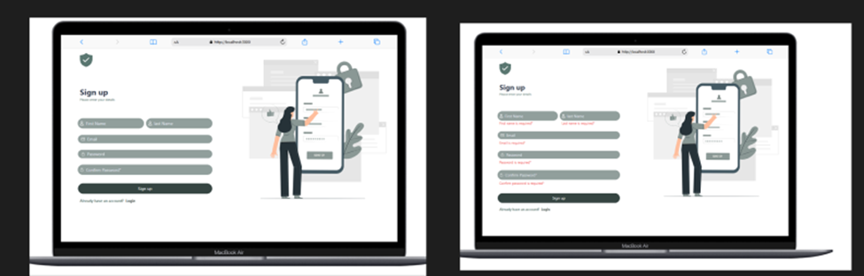

### Login Page

- **Endpoint:** [http://localhost:3000/login](http://localhost:3000/login)
- **Screenshot:**
  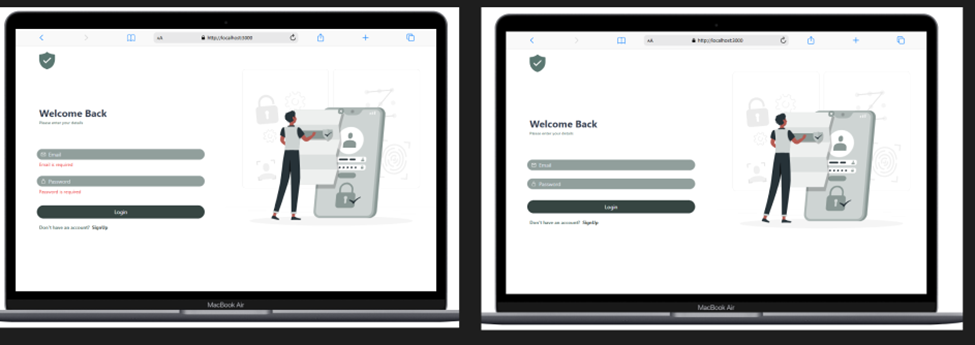

### Home Page

- **Endpoint:** [http://localhost:3000](http://localhost:3000)
- **Screenshots:**
  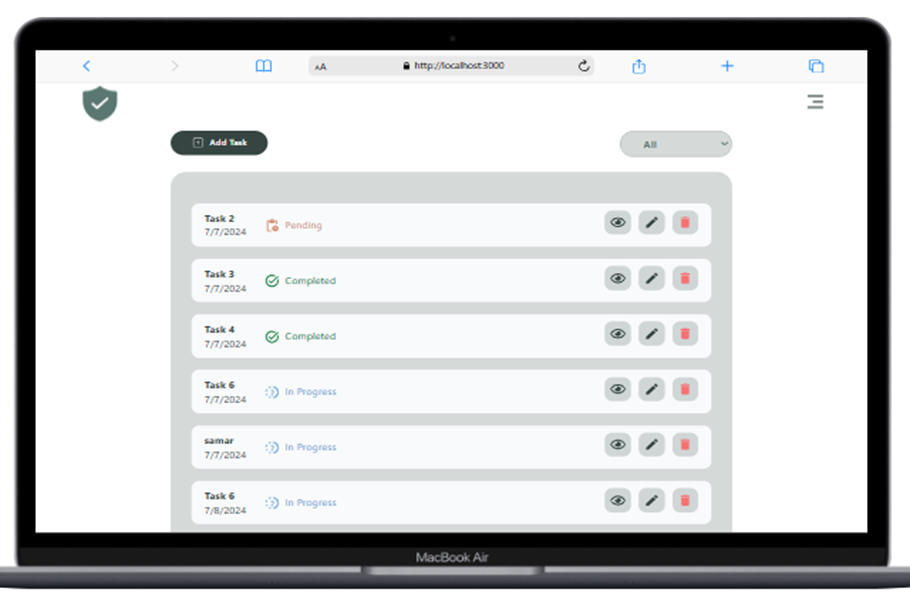
  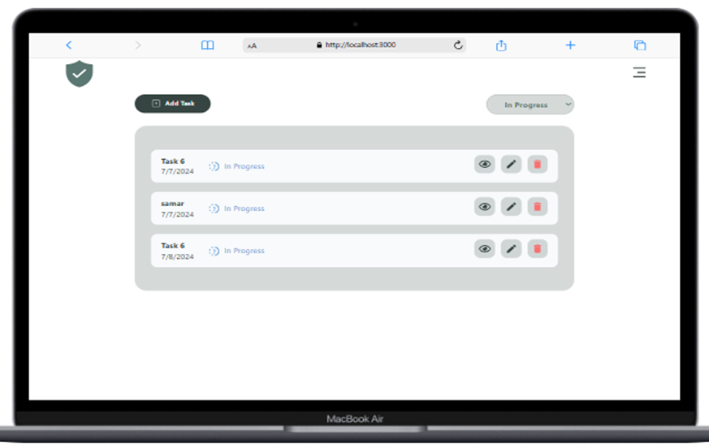
  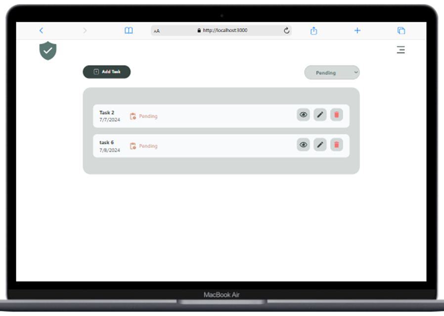

### Add Task Page

- **Endpoint:** [http://localhost:3000/tasks/add](http://localhost:3000/tasks/add)
- **Screenshot:**
  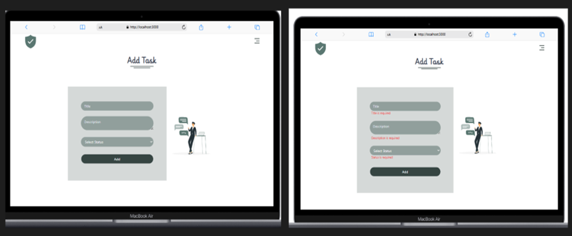

### Edit Task Page

- **Endpoint:** [http://localhost:3000/tasks/edit/:id](http://localhost:3000/tasks/edit/:id)
- **Screenshot:**
  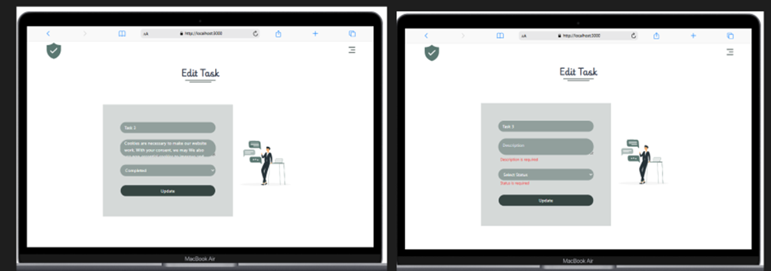

### Task Details

- **Screenshot:**
  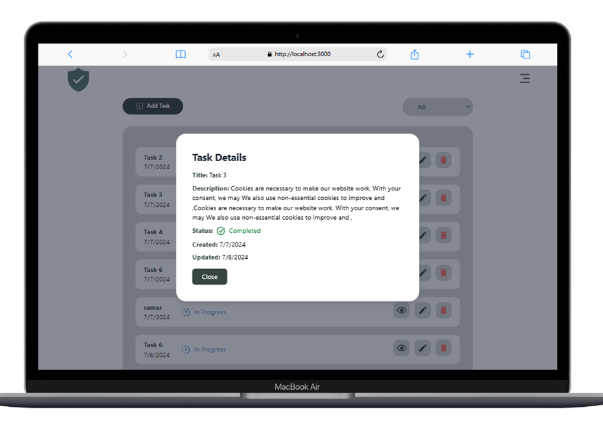

### Confirm Delete

- **Screenshot:**
  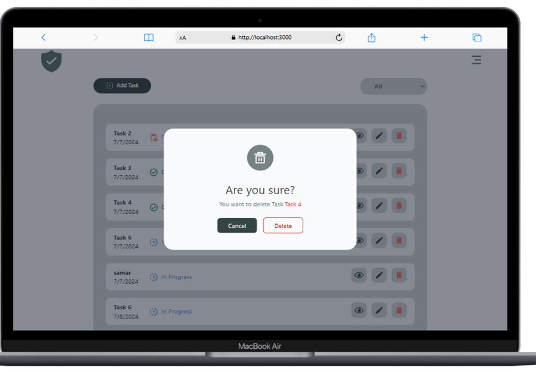

### User Profile Page

- **Endpoint:** [http://localhost:3000/profile](http://localhost:3000/profile)
- **Screenshot:**
  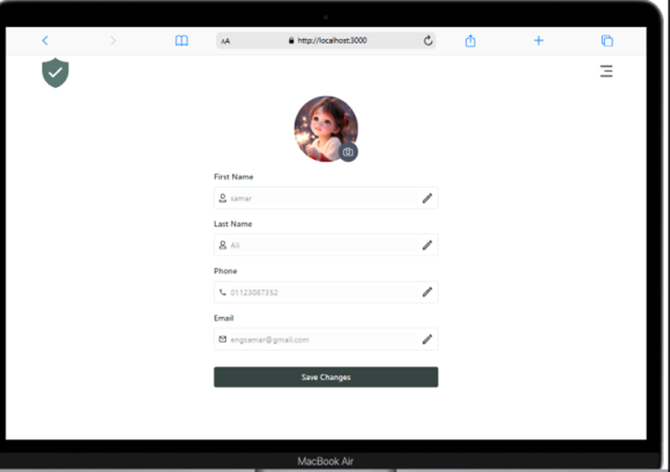

### Page Not Found

- **Endpoint:** [http://localhost:3000/not-found](http://localhost:3000/not-found)
- **Screenshot:**
  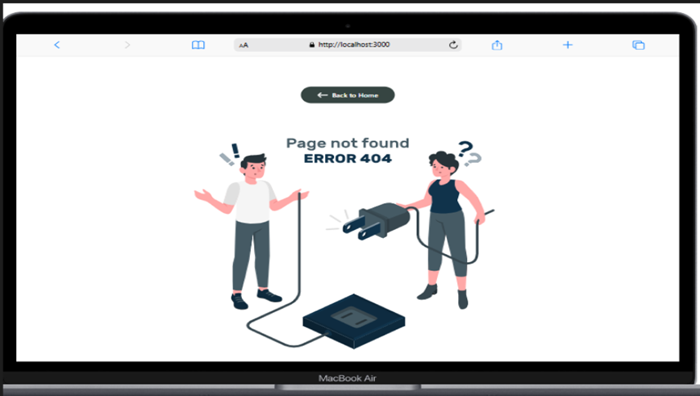

### Page When No Tasks For User

- **Screenshot:**
  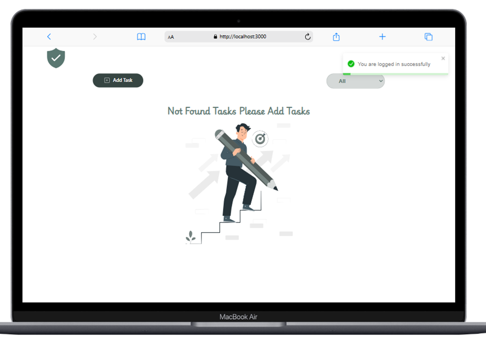

## Loader

### 1. Skeleton Loader

Display a skeleton loader while tasks are being fetched and displayed.

### 2. Custom Loader for Adding or Editing Tasks

- **Screenshot:**
  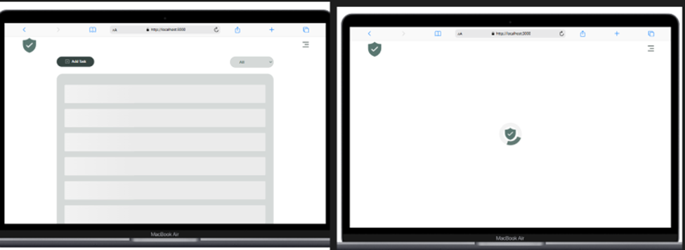

# Database (SQL Server)

## ERD

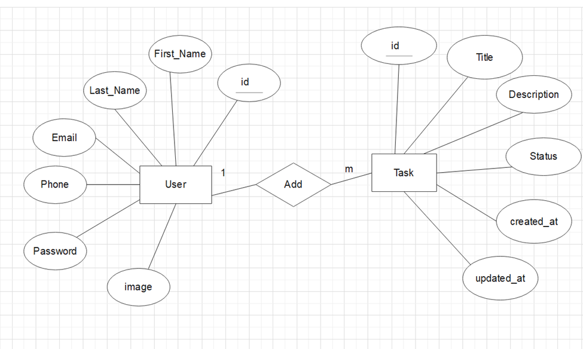

## Schema

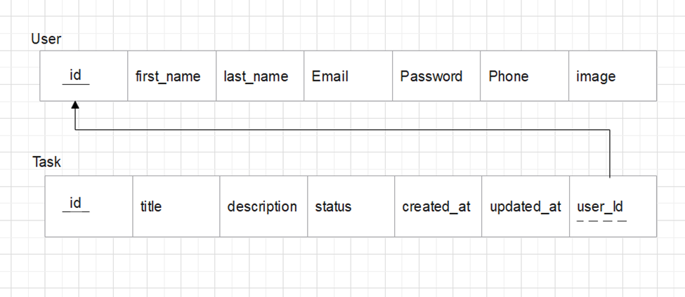

## SQL Scripts

### 1. Create the Database

```sql
CREATE DATABASE Task;
GO
```

### 2. Use the Database

```sql
USE Task;
GO
```

### 3. Create the Users Table

```sql
CREATE TABLE Users (
    id INT PRIMARY KEY IDENTITY(1,1),
    password VARCHAR(255) NOT NULL,
    image VARCHAR(255) DEFAULT '1.jpg',
    firstname VARCHAR(50) NOT NULL,
    lastname VARCHAR(50) NOT NULL,
    email VARCHAR(100) UNIQUE NOT NULL,
    phone VARCHAR(20)
);
```

### 4. Create the Tasks Table

```sql
CREATE TABLE Tasks (
    id INT PRIMARY KEY IDENTITY(1,1),
    title VARCHAR(255) NOT NULL,
    description VARCHAR(255),
    status VARCHAR(50) NOT NULL CHECK (status IN ('Pending', 'In Progress', 'Completed')),
    userId INT,
    FOREIGN KEY (userId) REFERENCES Users(id),
    created_at DATETIME DEFAULT GETDATE(),
    updated_at DATETIME DEFAULT GETDATE()
);
```

### 5. SQL Queries

#### 5.1 Tasks

- **Retrieve All Tasks for a User**

  ```sql
  SELECT * FROM Tasks WHERE userId = @userId;
  ```

- **Retrieve a Single Task by ID for a User**

  ```sql
  SELECT * FROM Tasks WHERE id = @id AND userId = @userId;
  ```

- **Retrieve Tasks with Specific Status for a User**

  ```sql
  SELECT * FROM Tasks WHERE status = @status AND userId = @userId;
  ```

- **Create a New Task**

  ```sql
  INSERT INTO Tasks (title, description, status, userId, created_at, updated_at)
  VALUES (@title, @description, @status, @userId, GETDATE(), GETDATE());
  ```

- **Update an Existing Task**

  ```sql
  UPDATE Tasks
  SET title = @title, description = @description, status = @status, updated_at = GETDATE()
  WHERE id = @id AND userId = @userId;
  ```

- **Delete a Task**
  ```sql
  DELETE FROM Tasks WHERE id = @id AND userId = @userId;
  ```

#### 5.2 Users

- **Retrieve a User by ID**

  ```sql
  SELECT * FROM Users WHERE id = @id;
  ```

- **Retrieve a User by Email**

  ```sql
  SELECT * FROM Users WHERE email = @email;
  ```

- **Update a User**

  ```sql
  UPDATE Users
  SET firstname = @firstname, lastname = @lastname, password = @password, phone = @phone, image = @image
  WHERE id = @id;
  ```

- **Create a New User**
  ```sql
  INSERT INTO Users (firstname, lastname, email, password)
  VALUES (@firstname, @lastname, @email, @password);
  ```
